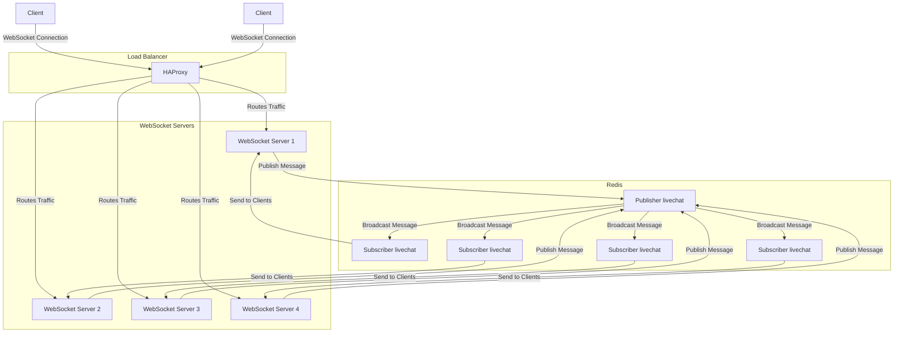

# WebSocket Load Balancer with HAProxy

## Running the Application

1. Start the services using Docker Compose:
   ```sh
   docker-compose up
   ```
   
2. Open your browser console and run the following commands to create a WebSocket connection:
   ```js
   let ws = new WebSocket("ws://localhost:8080");
   ws.onmessage = message => console.log(`Received: ${message.data}`);
   ws.send("Hello! I'm a client");
   ```
   
3. Open multiple console windows to simulate multiple clients and observe how messages are handled.

## Architecture Diagram



Enjoy testing your WebSocket load balancing setup!

### Ref

* [Scaling Websockets with Redis, HAProxy and Node JS - High-availability Group Chat Application](https://www.youtube.com/watch?v=gzIcGhJC8hA)
